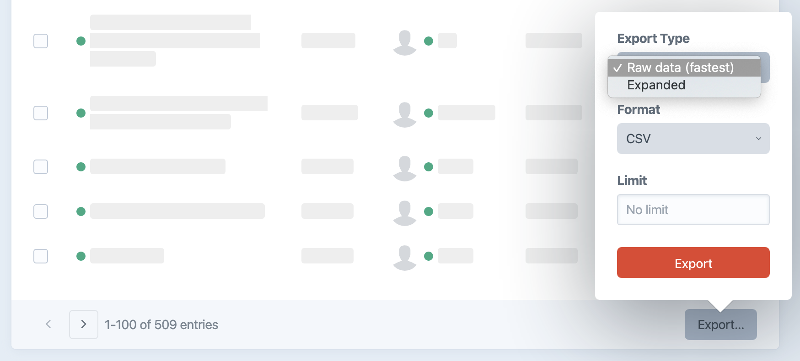

# Element Exporter Types

Element index pages in the control panel have the ability to export elements as CSV, XML, or JSON files.



The data included in these files is determined by the selected **exporter type**. Craft comes with two exporter types out of the box:

1. **Raw Data (fastest)**: a simple dump of the raw element query results
2. **Expanded**: a more fleshed-out export that includes data for all custom fields, including Matrix and relational fields

## Creating Custom Exporter Types

Plugins can provide custom exporter types for element index pages by creating a class that implements <craft4:craft\base\ElementExporterInterface>.

As a convenience, you can extend <craft4:craft\base\ElementExporter>, which provides a base exporter type implementation.

There are two methods that your exporter type should define:

- **[displayName()](craft4:craft\base\ComponentInterface::displayName())** _(static)_ – returns the user-facing name of the exporter type (shown in the **Export Type** dropdown menu within the Export HUD).
- **[export()](craft4:craft\base\ElementExporterInterface::export())** – Accepts an element query, and returns the export data. Each item of the returned array represents one row of data, and should be set to a nested array of the column values.

::: tip
Make sure that each of the nested arrays returned by `export()` contain the exact same array keys.
:::

Here’s an example exporter type that provides the title, status, and URL of the selected elements, along with titles of any entries related via a field called `relatedEntries`:

```php
<?php

namespace mynamespace\exporters;

use Craft;
use craft\base\EagerLoadingFieldInterface;
use craft\base\Element;
use craft\base\ElementExporter;
use craft\base\Field;
use craft\elements\db\ElementQuery;
use craft\elements\db\ElementQueryInterface;
use craft\helpers\ArrayHelper;

class MyCustomExporter extends ElementExporter
{
    public static function displayName(): string
    {
        return 'My Exporter';
    }

    public function export(ElementQueryInterface $query): array
    {
        $results = [];

        // Eager-load the entries related via the relatedEntries field
        /** @var ElementQuery $query */
        $query->with(['relatedEntries']);

        foreach ($query->each() as $element) {
            /** @var Element $element */
            $results[] = [
                'Title' => $element->title ?? '',
                'Status' => ucfirst($element->status),
                'URL' => $element->getUrl(),
                'RelatedEntries' => ArrayHelper::getColumn(
                    $element->relatedEntries,
                    'title'
                ),
            ];
        }

        return $results;
    }
}
```

The user-selected output format determines how a value will be rendered. Here’s how the `Related` example above would appear in each format:

::: code

```markdown CSV
RelatedEntries
"[""Title 1"",""Title 2""]"
```

```json
{
  "RelatedEntries": [
    "Title 1",
    "Title 2"
  ]
}
```

```xml
<RelatedEntries>
  <item>Title 1</item>
  <item>Title 2</item>
</RelatedEntries>
```

:::

## Registering Custom Exporter Types

To get an element exporter type to show up on an element index page, it has to be registered with the element type.

If it’s for a custom element type that is defined by the same plugin or module, simply include your element action in the element class’s [defineExporters()](element-types.md#index-page-exporters) method.

If it’s for an element type that is out of the plugin’s control, you can register it using the `registerExporters` event:

```php
<?php
namespace mynamespace;

use craft\base\Element;
use craft\elements\Entry;
use craft\events\RegisterElementExportersEvent;
use yii\base\Event;

class Plugin extends \craft\base\Plugin
{
    public function init()
    {
        Event::on(
            Entry::class,
            Element::EVENT_REGISTER_EXPORTERS,
            function(RegisterElementExportersEvent $event) {
                $event->exporters[] = MyExporter::class;
            }
        );

        // ...
    }

    // ...
}
```
