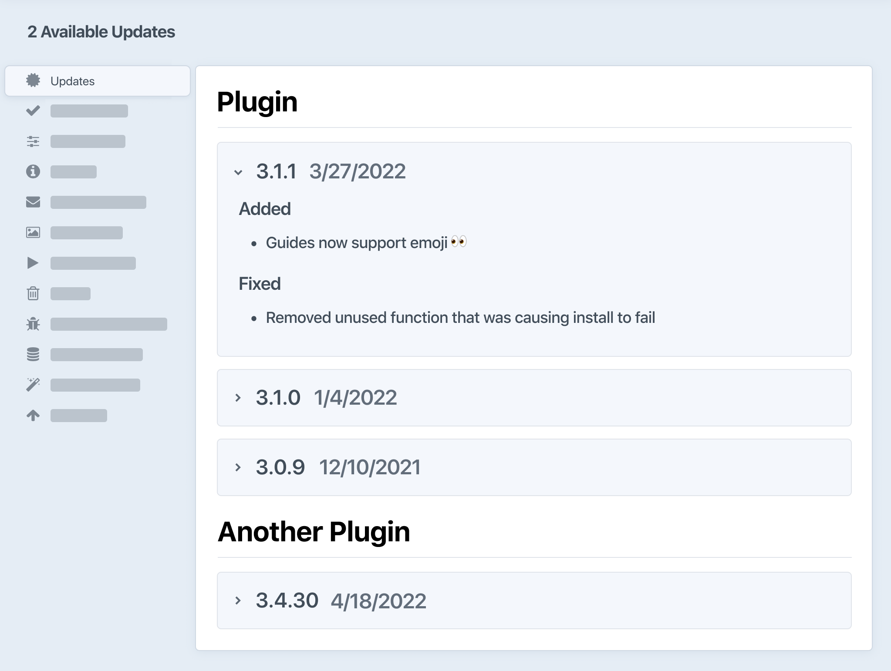

# Updating Instructions

## Updating from the Control Panel

When an update is available, users with the permission to update Craft will see a badge in the control panel next to **Utilities** in the global navigation:


Click **Utilities** → **Updates**. (You can also get to this view directly from the **Updates** widget that’s installed by default in the control panel dashboard.)

This section displays updates for Craft CMS and installed plugins, where each version has its own collapsible panel detailing relevant changes.



There may be an **Update** button next to each item and an **Update All** at the top of the screen, depending on your the <config4:allowUpdates> and <config4:allowAdminChanges> settings for your current environment. You can use those to initiate updates directly from the control panel.

::: tip
Craft’s [changelog](https://github.com/craftcms/cms/blob/main/CHANGELOG.md) will warn you of any critical changes at the top of the release notes. While there aren’t usually any warnings, it’s always a good idea to check the changelog and [any upgrade guides](#upgrade-guides) before updating.
:::

## Updating from the Terminal

The [`update` console command](console-commands.md#update) can be used to update Craft and plugins.

To see available updates, go to your Craft project in your terminal and run this command:

```bash
php craft update
```


To update everything all at once, run this command:

```bash
php craft update all
```

To update a specific thing, replace `all` with its handle (either `craft` to update Craft, or a plugin’s handle).

```bash
php craft update element-api
```


You can also pass multiple handles in at once:

```bash
php craft update element-api commerce
```

By default, Craft will update you to the latest available version. To update to a specific version, append `:<version>` to the handle:

```bash
php craft update element-api:2.7.0
```

Craft also provides an `update/composer-install` command, which behaves like the `composer install` command, but doesn’t require you to have Composer installed.

## Upgrade Guides

Sometimes there are significant changes to be aware of, so it’s worth checking the upgrade guide for each version or edition along your upgrade path.

- [Upgrading to Craft 3.7](https://craftcms.com/knowledge-base/upgrading-to-craft-3-7)
- [Upgrading to Craft 3.6](https://craftcms.com/knowledge-base/upgrading-to-craft-3-6)
- [Upgrading to Craft 3.5](https://craftcms.com/knowledge-base/upgrading-to-craft-3-5)
- [Upgrading to Craft Pro](https://craftcms.com/knowledge-base/upgrading-to-craft-pro)
