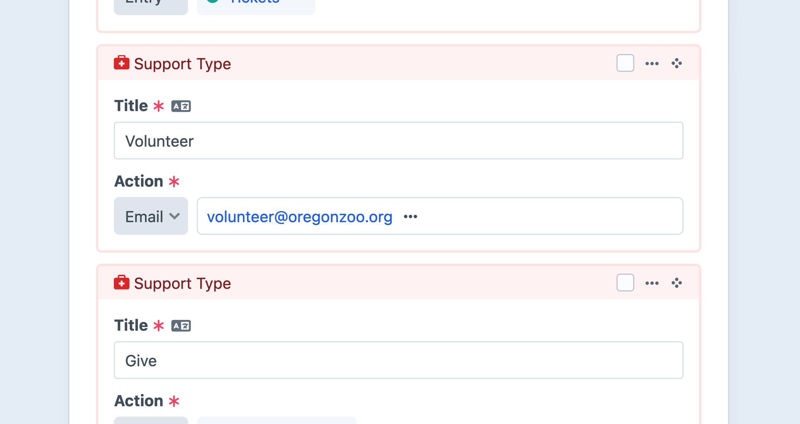

---
related:
  - uri: ../../system/fields.md
    label: Learn about content and custom fields
---

# Link Fields <Badge text="New!" />

::: tip
The link field replaced the URL field in [Craft 5.3](github:craftcms/cms/releases/5.3.0). Your existing fields will be automatically enhanced with the new UI. If you want to take advantage of the new features (like linking to assets, categories, and entries), check out the field’s edit screen.
:::

Link fields provide a flexible way to link to on- and off-site resources, including assets, categories, entries, email addresses, phone numbers, or arbitrary URLs.



A link field’s value (when populated) is always suitable for use as an anchor tag’s `href` attribute:

```twig
<a href="{{ supportType.action }}">{{ supportType.title }}</a>
```

<!-- more -->

## Settings

<BrowserShot
  url="https://my-craft-project.ddev.site/admin/settings/fields/new"
  :link="false"
  :max-height="500"
  caption="Adding a new link field via the control panel.">

</BrowserShot>

In addition to the standard field options, Link fields have the following settings:

- **Allowed Link Types** — The type of resource(s) that can be linked. Selecting more than one link type displays a dropdown menu for the author.
  - **URL** — The value must be a valid URL, beginning with `http://` or `https://`.
  - **Asset** — Select an [asset](../element-types/assets.md) element.
  - **Category** — Select a [category](../element-types/categories.md) element.
  - **Email** — The value is automatically prepended with `mailto:`.
  - **Entry** — Select an [entry](../element-types/entries.md) element.
  - **Phone** — The value is automatically prepended with `tel:`.
- **Max Length** – The maximum number of characters the field can contain. (Defaults to `255`.)

When selecting a link type that references elements, Craft will display a set of checkboxes that allow you to limit selection to specific [sources](../../system/elements.md#sources)—and in the case of assets, the allowable file kinds.

## The Field

Link fields have—at minimum—an input specific to the allowed type of link. If more than one link type is allowed, a dropdown menu will be shown before the field, allowing the author to switch between them and use a specialized input to define a value.

## Development

Outputting a link field in a template will return a normalized value suitable for use in an anchor tag’s `href` attribute:

```twig

  <h3>Link</h3>
  {{ tag('a', {
    text: 'Learn More',
    href: entry.myLinkFieldHandle
  }) }}

```

### `LinkData`

The link field returns a <craft5:craft\fields\data\LinkData> object. When used as a string, its value is intelligently coerced to something URL-like—for element links, the element’s URL; for phone links, the number prefixed with `tel:`; and so on!

You can check what type of link the author selected, or access a selected element, directly:

```twig

  {{ entry.myLinkFieldHandle.element.render() }}

  {{ entry.myLinkFieldHandle.link }}

```

The valid `type` values are `asset`, `category`, `email`, `entry`, `phone`, and `url`.

Like elements, you can also render a complete anchor tag:

```twig
{{ entry.myLinkFieldHandle.link }}
```

Craft will figure out the best textual representation of the link—a selected element’s `title`, the URL (sans protocol), or the raw phone number, for example.

### Relations

When using an element in a link field, Craft makes the corresponding connections in its [relations](../../system/relations.md) system. This means that you can query for elements via link fields, just like other [relational fields](../../system/relations.md#custom-fields):

```twig


{# -> Returns other entries connected to the given `post` via a specific link field. #}
```

::: warning
It is not currently possible to [eager-load](../../development/eager-loading.md) link field relationships, as their element type is not known until the field data is loaded.
:::
