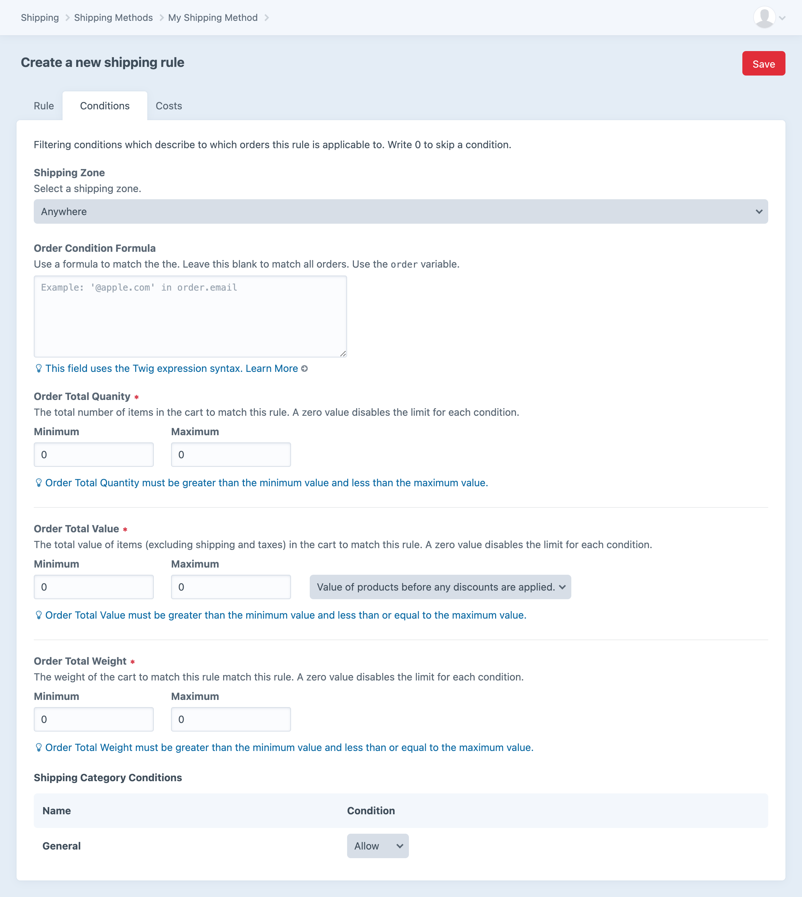
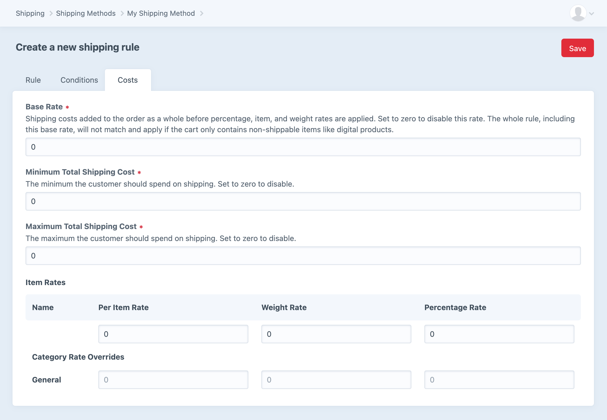

# Shipping

Craft Commerce includes a shipping system for adding shipping costs to a cart.

::: warning
[Shipping features differ](#edition-differences) depending on your edition of Craft Commerce.
:::

You can add any number of [shipping methods](#shipping-methods) to your store, where each one’s purpose is to supply relevant *shipping options* for an order at checkout.

The shipping method determines relevant options with its [shipping rules](#shipping-rules) and the store’s [shipping categories](#shipping-categories) and [shipping zones](#shipping-zones) configured in the control panel.

A store manager can see and manage these shipping details via **Commerce** → **Shipping** in the control panel.

Let’s look at each of these factors, starting with the broader shipping categories and zones.

## Shipping Categories

Shipping categories are used to classify products according to how they’re shipped. At least one shipping category is required, but you can use any number of them.

In the control panel, you’ll see the relationship between products and shipping categories in several places:

1. When creating or editing a shipping category from **Commerce** → **Shipping** → **Shipping Categories**, an **Available to Product Types** field lets store managers select the product types the category should be available to.
2. When creating or editing a [product type](products-variants.md#product-types), you’ll have a read-only view of the shipping categories available to it in the **Tax & Shipping** tab.
3. When editing an individual product, the default shipping category will be selected in a dropdown along with any other categories available for that product type.

While setting up [shipping rules](#shipping-rules), the available shipping categories can factor into the rule’s conditions and costs.

For example, you might set up a shipping rule that’s unavailable when the cart has a product in a specific shipping category. You might have another shipping rule that returns special shipping prices for different categories of products in the cart.

## Shipping Zones

Shipping zones are geographical areas your store ships to. Shipping zones can be made up of one or more countries, and (optionally) specify one or more states within those countries. They can also provide a zip code condition formula.

For example, you might make one zone for the USA and Canada, and another zone for the international countries you ship to.

Like shipping categories, these tax zones can factor into [shipping rule](#shipping-rules) conditions and costs. Shipping zones can be used for conditions that apply to the customer’s shipping address.

### Zip code condition formula

In addition to country and state matching, an address can match a zip code condition formula.

A zip code condition formula is an expression written in [Twig’s expression syntax](https://twig.symfony.com/doc/2.x/templates.html#expressions) that returns `true` or `false`.

This will match if the zip code’s first two characters are `60` or `70`:

```
zipCode[0:2] == '60' or zipCode[0:2] == '70'
```

The will match if the zip code is equal to `NG102`, `ZZ200`, or `CC101`:

```
zipCode in ['NG102', 'ZZ200', 'CC101']
```

## Shipping Methods

Shipping methods are the choices available to the customer during checkout. For example, a shipping method might be called “Pickup”, “FedEx”, “USPS”, or “Express”.

You can name these shipping methods anything that makes sense to the customer. They don’t need to be shipping company names, but usually indicate the delivery method. For example, you could have two shipping methods: one called “FedEx Standard” and “FedEx Overnight”.

Shipping methods contain a collection of shipping rules, which are conditions for determining when the shipping method should be available.

::: warning
If a customer changes their shipping address during checkout, a previously selected shipping method may no longer match and will be immediately removed as the shipping method set on the cart.
:::

## Shipping Rules

Shipping rules belong to a shipping method and may be edited in that shipping method’s “Rules” tab after it’s first saved. Each rule is checked one by one, in order, against the cart to see if it’s a match. The first rule that matches the cart supplies the pricing to the shipping method. If no rules match the cart, that shipping method is not available for the customer to select.

## Shipping Rule Conditions

The matching of the shipping rules to the cart is based on the following rules conditions:



### Shipping Zone

Each shipping rule can have a single zone. This condition is met if the order’s shipping address falls within this zone.

### Order Condition Formula

An optional condition for specifying criteria for the shipping method to be available for selection.

The condition formula can use an `order` variable, which for safety is an array and not the order element—it’s the same representation of the order you’d see if you exported it from the order index page. This data-only format prevents a store manager from accidentally calling methods like `order.markAsComplete()`.

::: tip
The condition formula’s `order` array is generated with:

```php
$order->toArray(
    [], ['lineItems.snapshot', 'shippingAddress', 'billingAddress']
);
```
:::

### Order Total Quantity

This condition is met if the order has at least and/or at most a certain number of items.

### Order Total Value

This condition is met if the total order price is at least and/or at most a certain amount.

### Order Total Weight

This condition is met if the total order weight is at least and/or at most a certain amount.

### Shipping Categories

The shipping rule has options for each category in the system. Each shipping category can be set to:

1. **Allow**: products can be allowed for this shipping method.
2. **Disallow**: if products are found in the cart the rule will not match the cart.
3. **Require**: products must exist in the cart for this rule to match.

This rule can allow, disallow, or require certain products to match this rule.

## Shipping Rule Costs



### Base Rate

Set a base shipping rate for the order as a whole. This is a shipping cost added to the order as a whole and not to a single line item.

### Minimum Total Shipping Cost

The minimum the person should spend on shipping.

### Maximum Total Shipping Cost

The maximum the person should spend on shipping after adding up the base rate plus all item-level rates.

### Item Rates

#### Per Item Rate

Set a default per-order item shipping rate.

#### Weight Rate

Default cost per whole unit of the store’s dimension units. For example, if you set your dimension unit option to Kilograms, your product weight is 1.4Kg, and you enter `1` as the “Weight Rate”, then the price will be \$1.40.

#### Percentage Rate

The default amount based on a percentage of item’s cost.

#### Category Rate Overrides

You can further customize the Per Item, Weight, and Percentage rates in each category.

## Configuration Examples

There are lots of ways you might combine the included shipping rules depending on what matters most for your store.

For example, some stores may sell relatively uniform items that ship to a number of specific **areas**. In this case, the shipping configuration will depend heavily on zones and rules that ensure the right shipping methods are available for each target zone.

Another type of store may have broad **variation in product types**, from a pack of stickers to a refrigerator that may require a radically different type of shipping. This store’s shipping configuration will likely emphasize shipping prices per product type.

Yet another store may place more importance on providing a **broad range of delivery methods**, meaning its shipping configuration will rely heavily on categories and rules across a significant number of shipping methods.

It’s best to identify whatever aspect of the store’s shipping is most complex or specific, and plan around that concern with whatever features need to support it.

## Edition Differences

In the Lite edition of Craft Commerce only two fixed shipping costs can be configured:

1. A single fixed per-order shipping cost
2. A per-item fixed shipping cost

These shipping cost settings can be updated in **Commerce** → **Settings** → **General**, and show up on every order made when running the Lite edition of Craft Commerce. You can set these to zero if no shipping costs need to be added to the order.

In the Pro edition of Commerce, complex shipping rules including categories, zones and rules are available. The core components of the shipping system are:

- Shipping categories
- Shipping zones
- Shipping methods and rules

Shipping methods and rules are at the core of the shipping engine in the Pro edition of Craft Commerce. The shipping rules use shipping categories, shipping zones, and additional order conditions to determine which shipping methods are available to the cart for customer selection.

::: tip
See the [Shipping Methods](extend/shipping-methods.md) page in the _Extending Commerce_ section to learn how to write your own custom shipping method.
:::

## Templating

### cart.availableShippingMethodOptions

Returns the shipping method options available for the current cart. Some shipping methods may not be included, as only those whose rules apply to the current cart will be returned.

```twig

  
  
  <label>
    <input type="radio"
      name="shippingMethodHandle"
      value="{{ handle }}"
      {{ isCurrentSelection ? ' checked' : '' }}
    />
    <strong>{{ method.name }}</strong> {{ formattedPrice }}
  </label>

```
