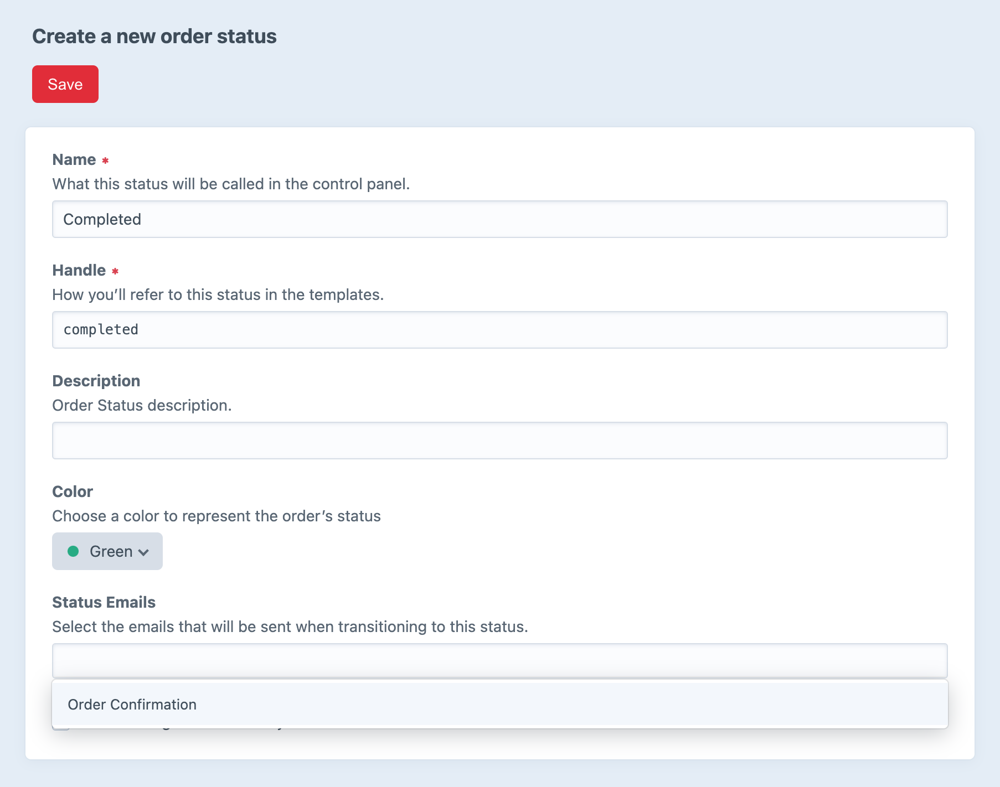
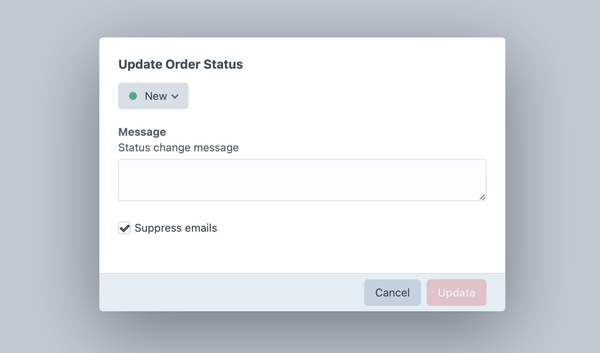

# Emails

Once you’re using [order statuses](custom-order-statuses.md#functionality) to manage your orders, you can optionally choose to send emails when an order moves into a particular status.

For example, you might create an email called “Customer Order Confirmation” which emails a completed order summary to the customer. This would be linked to the default order status since we want it to trigger when the cart’s completed and becomes an order.

Another email could be “Admin Order Notification”, also attached to the default order status. Instead of being sent to the customer, however, it could go to the store owner’s email address and include stock or packing information.

The store manager can also send any email manually from an order’s edit page, whether that’s to re-send an email tied to a status change or to send an email that’s unrelated to any specific status at all.

## Settings

Before setting up emails for Craft Commerce, ensure that your Craft CMS installation is [properly configured for email delivery](https://craftcms.com/knowledge-base/why-doesnt-craft-send-emails#setting-up-email).
You can set up your email gateway in the control panel by navigating to **Settings** → **Email**.

::: tip
Commerce emails are sent in Craft queue jobs, so sending may be delayed depending on how your queue is configured to run. See the <config4:runQueueAutomatically> config setting and notes.
:::

By default, Commerce will send messages using Craft’s “System Email Address” and “Sender Name” found in **Settings** → **Email Settings** in the control panel. If you’d like to override this and provide your own from name/address, navigate to **Commerce** → **System Settings** → **General Settings** and enter your own “Status Email Address” and “From Name”.

## Creating an Email

To create a new email, navigate to **Commerce** → **System Settings** → **Emails**, and choose **New Email**:

<toggle-tip>


</toggle-tip>

Emails have the following configuration settings:

### Name

Enter the name of this email as it will be shown when managing it in the control panel.

### Email Subject

The subject of the email, which can be plain text or use Twig to set dynamic values. Two special variables are available:

- `order` is a populated [Order object](commerce4:craft\commerce\elements\Order).
- `orderHistory` is a populated [OrderHistory object](commerce4:craft\commerce\models\OrderHistory).

`order` is the cart or order relevant to the notification. The “Email Subject” we enter, for example, might be:

```twig
Order #{{ order.id }} received.
```

### Recipient

The “To” address or addresses for this email.

If “Send to the customer” is selected, the email will only be sent to the order’s customer in the language (locale) that customer used placing the order. This affects the use of the `|t` filter in other email fields that support Twig.

If “Send to custom recipient” is selected, an email address can be entered. The language of this email will be in the language of whatever user triggers the status change.

Like the [Email Subject](#email-subject), this field takes plain text as well as Twig values. Two special variables are available:

- `order` is a populated [Order object](commerce4:craft\commerce\elements\Order).
- `orderHistory` is a populated [OrderHistory object](commerce4:craft\commerce\models\OrderHistory).

`order` is the cart or order relevant to the notification. The “Recipient” we enter, for example, might be:

```twig
{{ order.email }}
```

This would send the email to the customer that created this order.

### Reply-To Address

The Reply-To address for this email.

This field takes plain text as well as Twig values. Two special variables are available:

- `order` is a populated [Order object](commerce4:craft\commerce\elements\Order).
- `orderHistory` is a populated [OrderHistory object](commerce4:craft\commerce\models\OrderHistory).

### BCC’d Recipient

The BCC addresses for this email. Most likely, you would BCC the store owner on order confirmation.

Separate multiple addresses with a comma (`,`).

This field takes plain text as well as Twig values. Two special variables are available:

- `order` is a populated [Order object](commerce4:craft\commerce\elements\Order).
- `orderHistory` is a populated [OrderHistory object](commerce4:craft\commerce\models\OrderHistory).

### CC’d Recipient

The CC addresses for this email. Separate multiple addresses with a comma (`,`).

This field takes plain text as well as Twig values. Two special variables are available:

- `order` is a populated [Order object](commerce4:craft\commerce\elements\Order).
- `orderHistory` is a populated [OrderHistory object](commerce4:craft\commerce\models\OrderHistory).

### HTML Email Template Path

The path to an HTML template in your site’s `templates/` folder.

This field takes plain text as well as Twig values. Two special variables are available:

- `order` is a populated [Order object](commerce4:craft\commerce\elements\Order).
- `orderHistory` is a populated [OrderHistory object](commerce4:craft\commerce\models\OrderHistory).

This allows you to have full design flexibility.

### Plain Text Email Template Path

The path to a plain text template in your site’s `templates/` folder.

This works the same way as the “HTML Email Template Path”.


### PDF Attachment

Choose a PDF that will be attached to this email.

## Selecting an Email

To use the email you’ve created, visit **Commerce** → **System Settings** → **Order Status** and choose the Order Status that should send this email when it updates.

Select the email by name in the **Status Emails** field. You can select as many emails as you’d like for any given Order Status.



Once you choose **Save**, the designated emails will be sent when an order is assigned that status.

## Suppressing Emails

There may be cases where you don’t want an order status change to send an email.

Orders have a memory-only [suppressEmails](commerce4:craft\commerce\elements\Order::$suppressEmails) attribute you can set to `true` to avoid sending email for anything that happens in that request. This is what the “Suppress email” options set when changing status from the order listing or edit views.



Any time an order status email is prepared, Commerce triggers a cancelable event. Set the event object’s `$isValid` proprty to `false` to prevent a status change email from being sent:

```php
use craft\commerce\events\OrderStatusEmailsEvent;
use craft\commerce\services\OrderStatuses;
use yii\base\Event;

Event::on(
    OrderStatuses::class,
    OrderStatuses::EVENT_ORDER_STATUS_CHANGE_EMAILS,
    function (OrderStatusEmailsEvent $event) {
        // Prevent sending an order status email
        $event->isValid = false;
    }
);
```

## Troubleshooting

It’s a good idea to always test your status email templates before relying on them in production.

Once you’ve configured a template, the quickest way to test it is by navigating to **Commerce** → **System Settings** → **Emails** and choosing **Preview** next to the relevant email. This will open a new tab/window to display the template rendered using a random completed order.

::: tip
You can add `&number=ORDER_NUMBER` to the preview URL to use a specific number. Replace `ORDER_NUMBER` with the order number you’d like to preview.
:::

If your template is rendering successfully but messages are failing to send, you’ll want to check these things in order:

1. **Make sure Craft’s queue is running.**\
If the [`runQueueAutomatically`](config4:runQueueAutomatically) setting is `true` you may want to establish a more reliable queue worker.
2. **Make sure any dynamic settings are parsed properly.**\
Some email settings support dynamic Twig values, where parsing errors can cause sending to fail: 
    - Email Subject
    - Reply To
    - Recipient
    - BCC’d Recipient
    - CC’d Recipient
    - HTML Email Template Path
    - Plain Text Email Template Path
3. **Make sure the HTML and Plain Text template paths exist and parse properly.**\
Syntax issues, undeclared variables, or missing information may prevent templates from rendering.
4. **Make sure included PDFs render properly.**\
If you’re including a [PDF](pdfs.md), it could have its own rendering issues that cause sending to fail. Be sure to preview the relevant PDF separately and ensure it’s working as expected.
5. **Avoid cart and session references.**\
Emails are sent by queue processes that don’t have access to cookies or sessions the cart depends on. References to `craft.commerce.carts.cart` or `craft.commerce.customers.customer`, for example, will result in session-related errors.

Commerce adds email jobs to the queue with [high priority](/4.x/extend/queue-jobs.md#specifying-priority) for drivers that support it. This helps ensure outgoing messages don’t get stuck behind slow, long-running tasks.

When an email fails to send in response to a status change, its queue job will be marked as failed and include an appropriate message. Once you fix the cause of the sending failure, you can retry sending the email from the queue via **Utilities** → **Queue Manager**.

::: tip
If a plugin suppresses an email (by listening to [`EVENT_BEFORE_SEND_MAIL`](extend/events.md#beforesendemail) and assigning `$event->isValid` to `false`), queue jobs will complete normally.
:::
