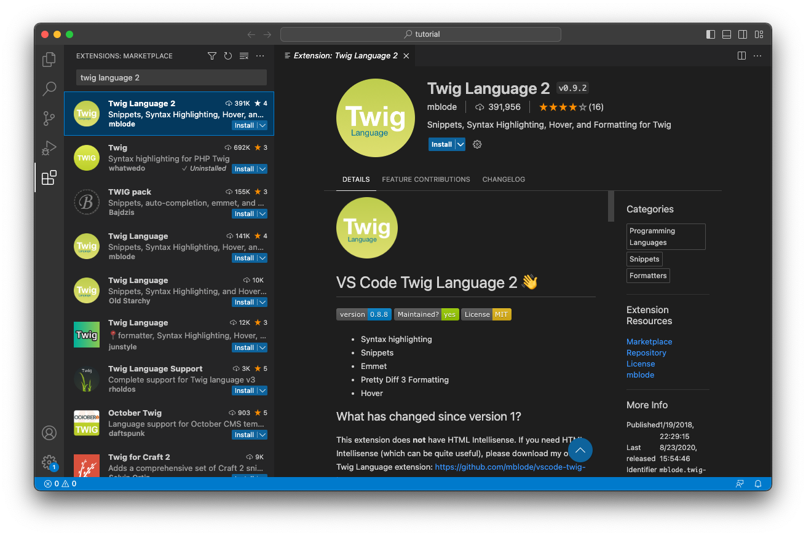

# Twig Basics

[Twig](https://twig.symfony.com/doc/3.x/) templates are plain text files that use special syntax to control Craft’s HTML output. When rendered, portions of a Twig file are inserted, replaced, omitted, or repeated, based on special instructions sprinkled throughout the HTML.

::: tip
If you’ve used Twig in other projects, that knowledge will be useful here. Craft adds a number of features to Twig, but the core principles (and syntax) are totally portable.
:::

## Why Twig?

Our goal in this section is to combine static HTML with dynamic content. Twig is a simple—yet powerful—language that allows us to translate the data we’ve defined in Craft into a blob of HTML that can then be sent back to a browser and displayed for a user.

The beauty of a template language is that a single template can be rendered many times with different data. Our main task will be to create a Twig template for our blog posts that 

::: tip
Any HTML document is also a valid Twig file, so if you have experience writing HTML _without_ a template language, you’re in a great position to start building with Craft.

If not, check out the [Getting Started with HTML](https://developer.mozilla.org/en-US/docs/Learn/HTML/Introduction_to_HTML/Getting_started) article on _Mozilla Developer Network_.
:::

## Your First Template

In VS Code, you should have `templates/index.twig` open. Let’s clear out that file (press <kbd>Command/Control + A</kbd>, then <kbd>Backspace</kbd>, or use the **Selection** menu) and replace it with this:

```twig
{{ siteName }}
```

## Syntax highlighting

So far, `index.twig` has been an impenetrable wall of white text.

VS Code has a built-in extension marketplace for installing add-ons that improve the experience of working with different languages or technologies. There’s a whole universe of customization available , but the following extensions will be useful here:

- **Twig Language 2** by _mblode_;
- **Tailwind CSS IntelliSense** by _Tailwind Labs_ (we’ll get to this, later);



Open the **Extensions** panel in VS Code, search for each one, and choose **Install**.

::: tip
You may need to restart or “reload” VS Code to give the extensions a chance to properly initialize.
:::

Our simple `index.html` file may not look much different, but once we drop some more code into it, you’ll start to appreciate the value of syntax highlighting!

## Twig Fundamentals

There are only a few things we figure you’ll want to know up-front about Twig’s syntax. You will be able to copy-and-paste everything else in the tutorial, but being able to pick out important bits and pieces will allow you to start tinkering on-the-fly.

<See path="/4.x/dev/twig-primer.md" description="Curious about all of Twig’s features? Check out our templating guide in the main documentation." />

Replace the contents of `templates/index.twig` with this:

```twig
{# This is a comment! It won’t appear in the HTML output. #}

{# Here’s some text, dynamically inserted into an HTML tag: #}
<h1>{{ siteName }}</h1>

{# What about a dynamic value? #}
<p>Today is {{ now | date }}!</p>

{# This is a variable, and it’s being set to a list (or “array”) of colors: #}


{# How many colors are in the list? #}
<p>The following list should contain {{ colors | length }} color(s).</p>

{# This is a loop that outputs those items, but sorts them first: #}
<ul>
  
    {# Let’s stylize each item using some inline CSS: #}
    <li style="color: {{ color }}">
      {# The color is capitalized for display: #}
      {{ color | title }}
    </li>
  
</ul>
```

For now, this code can serve as a quick-reference guide for Twig syntax. Read down through the template, and see if you can guess roughly what it’ll look like!

<BrowserShot url="https://tutorial.ddev.site/" :link="false">

</BrowserShot>
