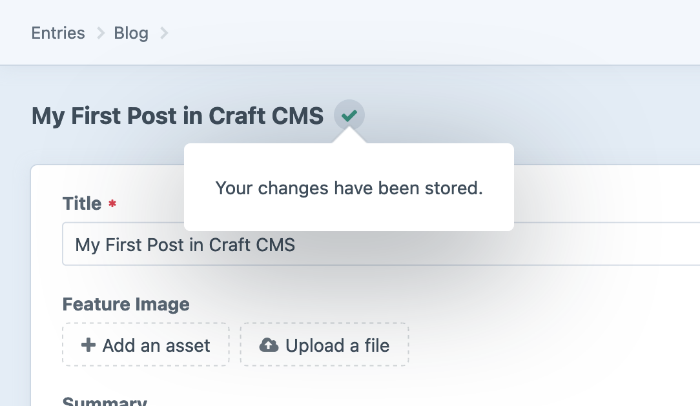

# Creating + Editing Entries

Our blog is starting to take shape!

## Add a Blog Post

If you haven’t already, navigate to **Entries** and click **+ New entry** to create your first post. Here’s what it’ll look like with a bit of content added:

<BrowserShot url="https://tutorial.ddev.site/admin/entries/blog/2?draftId=1&fresh=1" :link="false" caption="A complete blog post, ready to be saved.">

</BrowserShot>

## Explore Editing Features

Working with content in Craft is usually pretty intuitive—after all, _you_ just designed the authoring experience! Here are a few things to look out for, as you get started:

### Auto-saving

From the moment you arrive on an edit screen, Craft begins autosaving your changes as a _provisional draft_. You always get to decide when those changes are applied, though.

Edits on an already-published entry automatically start a new _draft_, and you can always see the save status and even leave notes in the versions menu. This menu will also let you see previous drafts and versions, which can be handy:

If you would like to turn your edits into a _draft_ so other users can review them, click **Create draft** instead of **Save**.

### Slideouts

Double-click any attached element (like the asset <Poi label="A" target="editAsset" id="source" />  in our **Featured Image** field) to edit it in a _slideout_. Here, we’ve taken the opportunity to clean up the uploaded image’s **Title** <Poi label="B" target="editAsset" id="title" />:

<BrowserShot
    url="https://tutorial.ddev.site/admin/entries/blog/2?draftId=1&fresh=1"
    id="editAsset"
    :poi="{
        source: [31, 42, 'A'],
        title: [65, 14, 'B'],
        sidebar: [96.3, 9, 'C'],
    }"
    :link="false"
    caption="Editing an asset in a slideout.">

</BrowserShot>

Click the sidebar button <Poi label="C" target="editAsset" id="sidebar" /> to view and edit additional details.

::: warning
Edits made in this way affect the original element, which means those changes will be visible anywhere else it’s used.
:::

### Matrix is pretty cool.

You can grab the handles next to Matrix blocks to re-order them, and each block has a menu just to the left of that handle you can use to collapse, disable or delete the block. You can also use this as a convenient place to insert new blocks:

### You can fine-tune details for how and when your post is displayed.

Craft will set a slug for you by default, and it’ll be used in the post URL once published. You can set **Post Date** to a future date/time to have it appear then, and optionally add an **Expiry Date** to have it disappear later. You can always flip _Enabled_ off and know the post will be hidden publicly, regardless of other settings.

### You can share drafts privately.

Choosing **Share** at the top of the entry will always give you a URL for viewing the content you’re looking at. If it’s unpublished content, the URL will include an `x-craft-preview` token that can be used for a limited time [determined by your settings](/3.x/config/config-settings.md#defaulttokenduration).

## Add about content

Navigate to **Entries**, select **Singles**, and choose **About**.

You’ll notice this is similar to editing a blog post entry, except that the slug is fixed and there are no post or expiry date fields. This is because the single isn’t one post in a series, but a single post meant to live at a specific URL.

Go ahead and add some content and publish it when you’re ready!

## Linking to pages

Once you’ve saved an entry, you can use the globe icon from the Entries listing to jump to its public URL. The result foreshadows what’s next:

<BrowserShot url="https://tutorial.ddev.site/blog/my-first-post" :link="false" caption="The front end is missing.">

</BrowserShot>

This is not an acceptable way to display a blog post. Let’s continue to the next section and build a front end!
