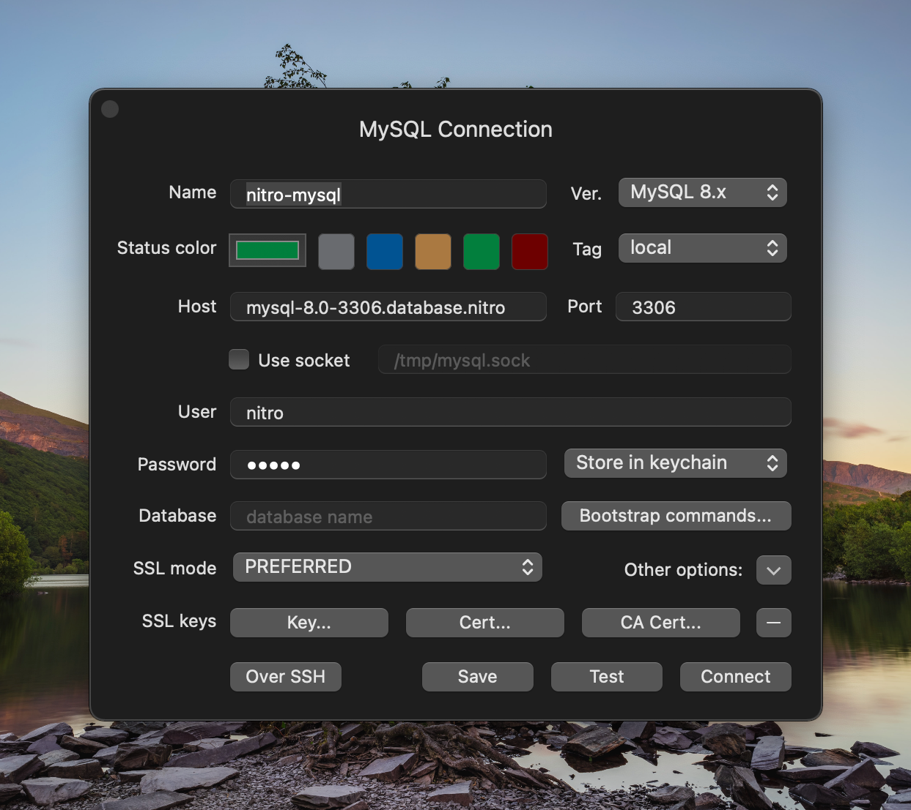

# Connecting with a GUI

When running the [`apply`](commands.md#apply), Nitro will set a friendly hostname for each of your databases and sites in your hosts file. Here is an example hosts file:

```
# <nitro>
127.0.0.1	mysql-8.0-3306.database.nitro plugins-dev.nitro tutorial.nitro
# </nitro>
```

In this example we have one database and two sites,`mysql-8.0-3306.database.nitro`, `plugins-dev.nitro`, and `tutorial.nitro`.

::: tip
Databases are prefixed with the `<engine>-<version>-<port>.database.nitro` name for easy access. If we wanted to connect to the MySQL 5.7 database running on port `3306` the hostname would be `mysql-5.7-3306.database.nitro`.
:::

To connect to the database with a GUI such as TablePlus, you can enter the following details:

**Host:** `mysql-8.0-3306.database.nitro`

**Port:** `3306`

**User:** `nitro`

**Password:** `nitro`


