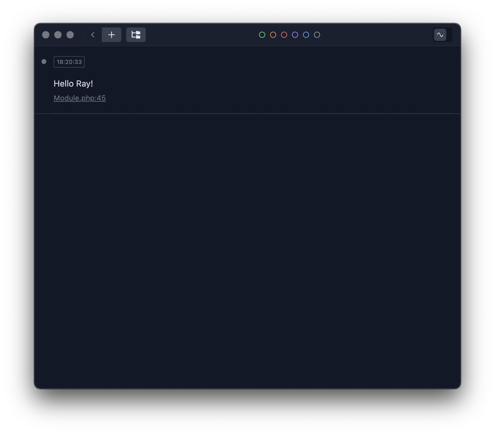

# Debugging with Ray

[Ray](https://myray.app/) is a Desktop PHP debugging tool that makes it easy to debug your PHP application.

## Installation

Ray is PHP framework agnostic, however there is a [helpful plugin](https://plugins.craftcms.com/craft-ray) to make configuring Craft and Ray super easy!

Install the plugin using the [`nitro composer`](commands.md#composer) command:

`nitro composer require spatie/craft-ray`

::: tip
If you only want to use Ray in development, run `nitro composer require spatie/craft-ray --dev`
:::

## Configuring

Visit the control panel -> plugins and enable the Ray.

**Host:** `host.docker.internal`

**Remote Path:** `/app`

**Local Path:** `/path/to/your/local/project`


## Usage

You can use Ray directly in your Twig templates or Plugin. To use Ray in Twig, open your template of choice and enter the following:

```twig
{{ ray("Hello Ray!") }}
```

::: tip
For a full site of available methods in Twig, visit the [Ray documentation for Craft CMS](https://spatie.be/docs/ray/v1/usage/craft-cms).
:::

The Ray desktop app will now have a new debug event!



To use Ray for plugin or module development, enter the following in your plugin:

```php
<?php

namespace modules;

use Craft;

class Module extends \yii\base\Module
{
    public function init()
    {
        Craft::setAlias('@modules', __DIR__);

        if (Craft::$app->getRequest()->getIsConsoleRequest()) {
            $this->controllerNamespace = 'modules\\console\\controllers';
        } else {
            $this->controllerNamespace = 'modules\\controllers';
        }

        ray('Hello Ray!');

        ray()->showEvents();

        parent::init();

        // Custom initialization code goes here...
    }
}
```

::: tip
For a complete list of available methods, see the [Yii2 documentation](https://spatie.be/docs/ray/v1/usage/yii2) for more detailed usage examples.
:::
