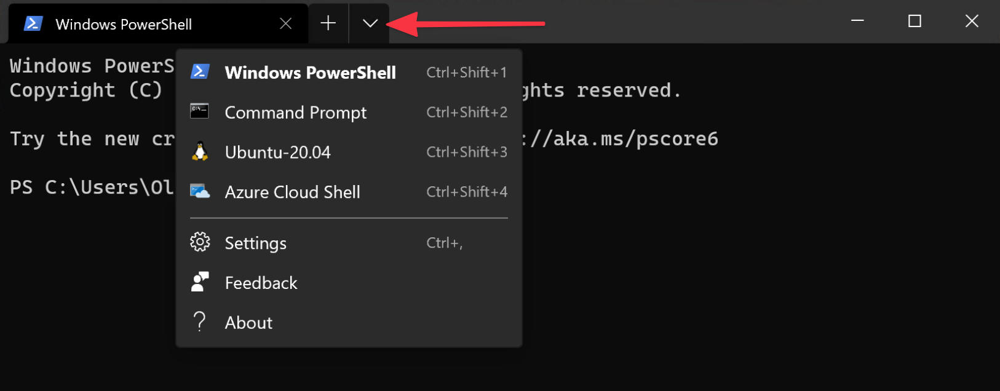

# Development with Nitro and WSL2

Nitro requires WSL2 for Windows, which runs the Linux distribution of your choice inside your normal Windows operating system. Nitro uses Docker in this environment to manage containers, and this comes with some limitations and performance tips you’ll want to be aware of.

## Mind Your Terminal

We highly recommend using [Windows Terminal](https://www.microsoft.com/en-us/p/windows-terminal/9n0dx20hk701), Microsoft’s relatively new, free app that provides easy access to the various Windows shells.

It opens PowerShell by default, which you’ll need for first installing WSL2, and the Ubuntu shell you’ll want for installing and using Nitro. You’d otherwise need to run “PowerShell” or “Ubuntu” separately from the start menu.



## Filesystem Performance is Best Inside WSL2

Running WSL2 means you have two filesystems: the Windows one you’re used to, where your home directory looks like `C:\Users\Oli`, and the Linux one where the home directory is something like `/home/oli`.

Each filesystem has a reference to the other: a `\\wsl$` share is available to Windows and a `/mnt` folder exists in the Linux filesystem. (So from the Ubuntu terminal, your Windows `C:\Users\Oli` folder is available at`/mnt/c/Users/Oli`.)

Using the Linux mount incurs a performance penalty, so it’s best to keep your project files in the Linux volume only. Your Ubuntu home folder is an ideal place for projects, i.e. `/home/oli/dev` which is equivalent to `~/dev`. As long as the full path to your project folder does not start with `/mnt`, you’ll get optimal performance from Nitro and Docker.

This also means working with your files from Windows is less convenient, but you can access the Linux filesystem from Windows by accessing the `\\wsl$` share.

::: tip
Enter `\\wsl$` in the File Explorer’s address bar and press <kbd>Enter</kbd>. You should see an “Ubuntu-20.04” share volume available to browse.
:::

If you use PhpStorm, you can load your project via `\\wsl$\Ubuntu-20.04\home\oli\dev\mysite.nitro`. Performance isn’t as fast as the native filesystem, but faster than going through `/mnt`.

[Visual Studio Code](https://code.visualstudio.com/) offers the best performance via the [Remote - WSL](https://code.visualstudio.com/docs/remote/wsl) plugin, which will mount the Linux filesystem on Windows inside of Visual Studio Code.

## Set Permissions When Adding a New Site

When adding a new site, you’ll need to manually set permissions from the root of the Craft project from within the WSL2 distro:

```sh
chmod 777 ./.env
chmod 777 ./composer.lock
chmod 777 ./composer.json
chmod -R 777 ./config
chmod -R 777 ./storage
chmod -R 777 ./vendor
chmod -R 777 ./web
```

## Manually Trust Certificates and Edit the Hosts File

The first time you add a Craft site, you’ll need to manually run a command on the Windows host machine to import a certificate file so SSL will work. You can follow the terminal output for exact instructions.

Nitro cannot edit the Windows hosts file at `C:\Windows\system32\drivers\etc\hosts` and will provide you with copy+paste instructions when it needs the file updated.