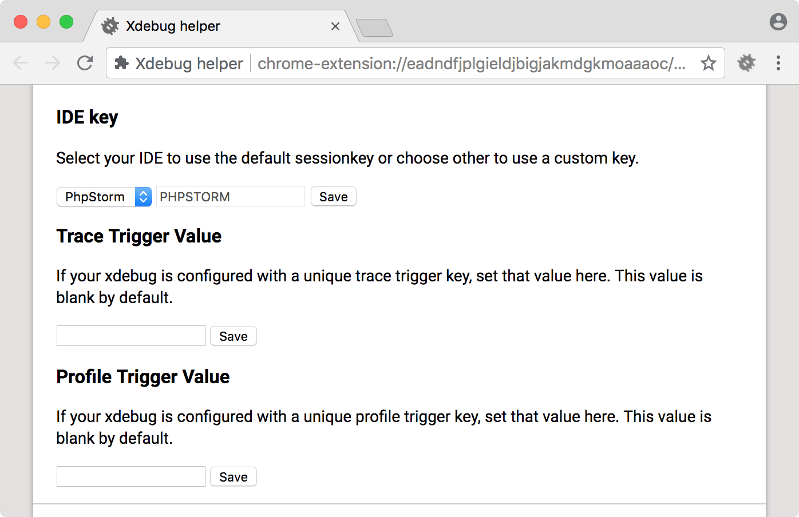
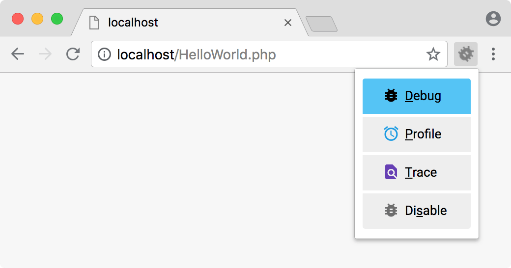

# Xdebug

Once you have sites running with Nitro, you can run [`nitro xon`](commands.md#xon) to enable [Xdebug](https://xdebug.org/) and set it up for automatic connections from your machine.

::: tip
You can use [`nitro xoff`](commands.md#xoff) to disable Xdebug.
:::

## Configuring PhpStorm

First, you’ll need to configure PhpStorm to listen for requests from the browser or console.

1. Create a new server in PhpStorm using your machine’s domain name. (**Preferences** → **Languages & Frameworks** → **PHP** → **Servers**.)\


2. Enable **Use path mappings** and set your existing project root to the absolute path on the server. The absolute path inside of the container will look like `/app`. (Use `nitro context` if you need to check the path, and keep in mind this is the project root and not necessarily the web root.)

3. Choose **Run** → **Edit Configurations...** and create a new **PHP Remote Debug** configuration, selecting the server you just created. Check **Filter debug connection by IDE key** and enter `PHPSTORM`.\


4. Choose **Run** → **Start Listening for PHP Debug Connections**.\


## Configuring VS Code

1. Install the [PHP Debug extension](https://marketplace.visualstudio.com/items?itemName=felixfbecker.php-debug)

2. Create a Launch Configuration specifying port 9003, path mappings, and your site’s hostname:

```js{5-9}
{
    "name": "Listen for XDebug",
    "type": "php",
    "request": "launch",
    "port": 9003,
    "pathMappings": {
        "/app": "${workspaceRoot}"
    },
    "hostname": "tutorial.nitro",
    "xdebugSettings": {
        "max_data": 65535,
        "show_hidden": 1,
        "max_children": 100,
        "max_depth": 5
    }
}
```

## Debugging Web Requests

1. Install the Xdebug helper in your favorite browser.

- [Chrome](https://chrome.google.com/extensions/detail/eadndfjplgieldjbigjakmdgkmoaaaoc)
- [Firefox](https://addons.mozilla.org/en-US/firefox/addon/xdebug-helper-for-firefox/)
- [Internet Explorer](https://www.jetbrains.com/phpstorm/marklets/)
- [Safari](https://github.com/benmatselby/xdebug-toggler)
- [Opera](https://addons.opera.com/addons/extensions/details/xdebug-launcher/)

2. In the browser helper’s options, choose your IDE key and save.\

    - For PhpStorm, select the **PhpStorm** option.
    - For VS Code, select **Other** and enter `VSCODE`.

3. Choose **Debug** on your browser’s Xdebug helper.\


4. Load the site in your browser and whatever breakpoints you’ve set will be hit.

## Debugging Console Requests

SSH into your Nitro machine using `nitro ssh`, then run your PHP script from the console and any breakpoints you’ve set will be hit.
